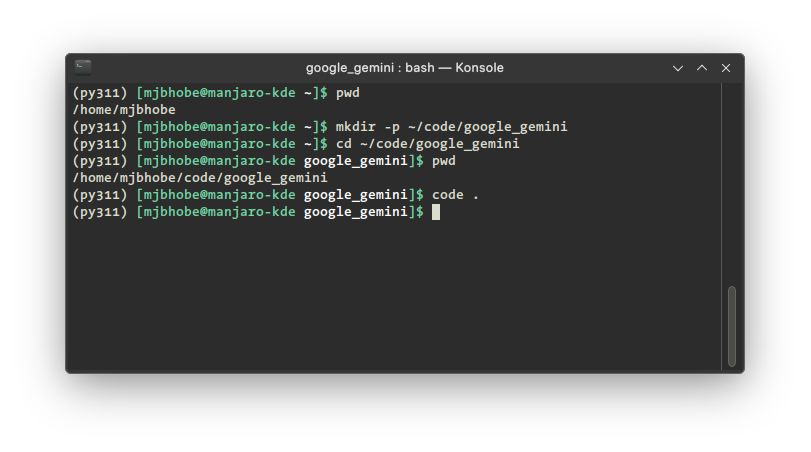
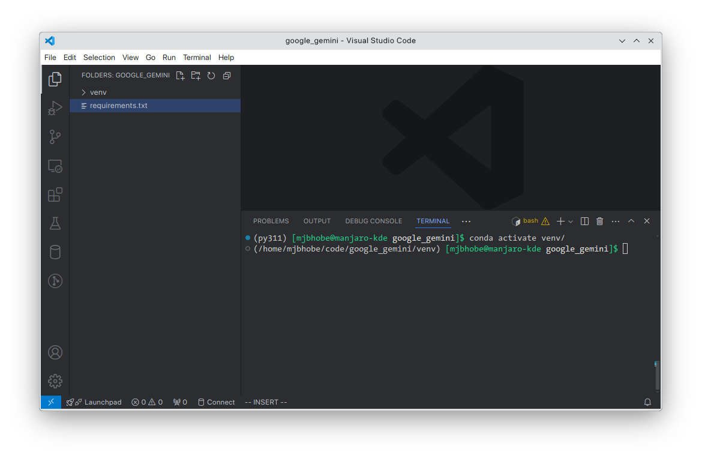
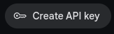
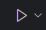
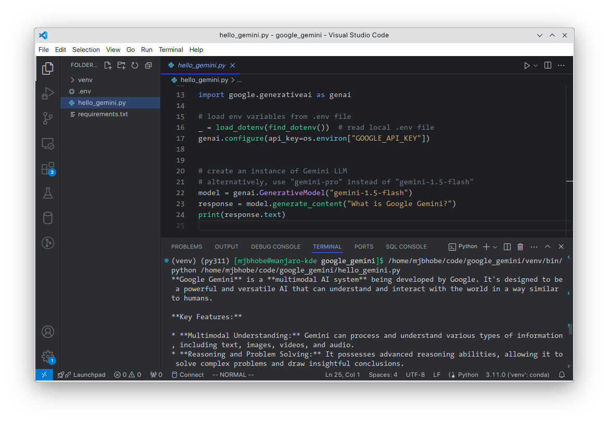

# Generative AI With Google Gemini


## Generative AI examples with Google Gemini LLM

**Note:**

These examples have been coded (mostly) on a Manjaro Linux KDE 6 powered machine, using Visual Studio Code and Python 3.11. I use `conda` to manage my Python environments, for which I have installed `miniconda` on my OS. Please refer to the [Miniconda Documentation](https://docs.anaconda.com/miniconda/) and [Visual Studio Code documentation](https://code.visualstudio.com/) for instructions on how to install these on your local machine. 

All screenshots below have been taken on the Manjaro Linux machine. You can transcribe these instructions to your local environment (i.e. Mac Os or Windows machine) easily.

### Setup:
**Setting up the folders**
* Fire up your command line terminal
* Create a new folder to hold all the code examples (for example `~/code/google_gemini`). We'll refer to this folder as `CODE_HOME` henceforth. Anywhere you see `$CODE_HOME`, expand it to the folder you created to hold all the code.
* Change directory to `$CODE_HOME` (i.e. `cd $CODE_HOME`)
* Type `code .` to start Visual Studio Code from the `$CODE_HOME` folder.


**Creating local virtual environment**

To avoid package conflicts, it is considered a best practice to create and use a local Python environment that your project will use. Follow the steps below to create a local environment:

* In Visual Studio Code, open a new Terminal (`Menu: Terminal -> New Terminal`)
* Create a local python environment in the `$CODE_HOME` folder `conda create -p venv python==3.11 -y`<br/>
  NOTE: This command will take some time to execute, depending on your internet/network speed. I have named the local environment `venv`, you can use whatever name you like. For Google Gemini, we'll need python version >= 3.9 - I have used 3.11. 
  
  I am using `conda` here to create the environment, you can use your favourite Python environment management module, such as `poetry` for example)

  After this command finishes execution, you will see a new folder `venv` in your project browser window in Visual Studio Code.

* Activate the local environment `conda activate venv/` - check your command line prompt to confirm that local environment has been activated (see screenshot below - the Terminal output)


**Installing required Python Packages**

* Create a `requirements.txt` file with the following entries - these are packaged we'll be using. You can add more to this list later.
  ```
  python-dotenv
  streamlit
  pypdf2
  black
  faiss-cpu
  pypdf2
  pillow
  beautifulsoup4

  # for PostgreSQL access
  psycopg2
  # for Gemini models
  google-generativeai
  # for Langchain
  langchain
  langchain-google-genai 
  ```
  Switch back to the Terminal & run
  `pip install -r requirements.txt` to install these packages.

  After these packages are installed, run the following command in terminal to install `ipykernel` - this package is required by Visual Studio Code to work with Notebook files.
  `pip install ipykernel`

**Setup API Keys**

Google Gemini API Key
  * Navigate to the [Get an API Key](https://aistudio.google.com/app/apikey) section of the Google AI Studio website
  * Click on the large gray 'Create API Key` button
  * Click the  button to create a new API key - follow instructions on dialogs to create the key.

    (**WARING: Immediately** copy the key to clipboard & paste into some local text editor - once generated you cannot copy again!)
  * In `$CODE_HOME`, create a `.env` file and add the following line to the `.env` file.

    `GOOGLE_API_KEY=<<the value of key you just copied to clipboard>>`

**Test your setup:**

* In Visual Studio Code create a new Python file `hello_gemini.py` and type in the following code.

  ```python
  import os
  from dotenv import load_dotenv, find_dotenv

  import google.generativeai as genai

  # load env variables from .env file
  _ = load_dotenv(find_dotenv())  # read local .env file
  genai.configure(api_key=os.environ["GOOGLE_API_KEY"])


  # create an instance of Gemini LLM
  # alternatively, use "gemini-pro" instead of "gemini-1.5-flash"
  model = genai.GenerativeModel("gemini-1.5-flash")
  response = model.generate_content("What is Google Gemini?")
  print(response.text)
  ```
* Ensure that the local `venv` environment you have created above is the active environment

  You can do this in 2 ways
    * Start a new Terminal with the `hello_gemini.py` code file open in code editor. The Terminal should open with the correct Python environment automatically selected. This is evident from the command line prompt, which should read something like `(venv) (py311) [<<some text>> google_gemini]$`
    * If this is not happening, manually select the correct Python interpreter to use:
      * Press Ctrl+Shift+P (Cmd+Shift+P on a Mac), and from dropdown displayed select "Python: Select Interpreter" option. This will display list of all Python environments you have created so far.
      * Select the one that says `Python 3.11.X ('venv': conda) ./venv/bin/python`, which is the local Python environment you just created.
* Run the code above by clicking the Run button 
* If you do not see any errors, then Congratulations! Your setup is working. Relax & get yourself a well-deserved cup/glass of your favourite beverage (tea/coffee/beer/whiskey?)

  

   